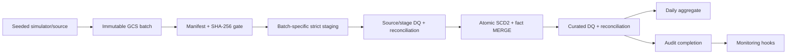

# Banking batch data warehouse

A production-pattern GCP batch warehouse reference implementation. It demonstrates immutable batch contracts, strict staging, SCD Type 2 dimensions, idempotent facts, reconciliation, quarantine, audit evidence, and conservative infrastructure automation.

## Evidence status

| Area | Status | Evidence |
|---|---|---|
| Deterministic simulator and manifest | Implemented, locally validated | Acceptance tests cover byte-for-byte replay, checksums, invalid and late-dimension batches |
| Reference warehouse semantics | Implemented, locally validated | Initial/replay/next-day, SCD invariants, atomic DQ failure, unknown-member repair |
| Airflow DAG | Implemented, locally parsed | Airflow 2.10.5 DagBag imports with no errors; cloud tasks were not executed |
| BigQuery DDL/procedures/DQ | Implemented, statically validated | SQLFluff BigQuery parser/lint; no authenticated BigQuery execution yet |
| Terraform | Implemented, locally validated | Terraform 1.14.5 format/init-without-backend/validate |
| GCP, Composer, monitoring | Optional, not deployed | `enable_composer=false`; requires authorized project, billing, WIF and state bootstrap |
| Dashboard | Not implemented | Looker Studio is a possible downstream consumer, not repository evidence |

## Architecture



See [architecture](docs/architecture.md), [data model](docs/data-model.md), [contract](docs/data-contract.md), and [runbook](docs/runbook.md).

## Local verification

Requires Python 3.12 and Terraform 1.14.5.

```bash
python -m venv .venv
. .venv/bin/activate
python -m pip install -e ".[dev]"
python -m pytest -q
ruff check .
sqlfluff lint bigquery --dialect bigquery --rules CP01 --ignore-local-config
terraform -chdir=infra/terraform init -backend=false
terraform -chdir=infra/terraform fmt -check -recursive
terraform -chdir=infra/terraform validate
```

Generate deterministic fixtures without committing them:

```bash
python data/simulator/generate_data.py --output data/generated --scenario initial --business-date 2026-01-01
python data/simulator/generate_data.py --output data/generated --scenario next_day --business-date 2026-01-02
```

For a DagBag test, install `requirements-airflow.txt` with the upstream Airflow 2.10.5 Python constraint file, then run `pytest -q tests/test_dagbag.py`.

## Deployment boundary

No cloud resources have been deployed. The manual deployment workflow requires repository variables for project, bucket, state bucket, WIF provider, and Terraform service account, plus approval on a GitHub `production` environment. Bootstrap instructions and exact post-deploy checks are in the runbook. Never commit credentials or state.

## Project assumptions

This portfolio system assumes one immutable daily batch at 02:00 Asia/Kolkata, completion within four hours, RPO of one accepted batch, RTO of eight hours, 365-day raw retention, and seven-day staging retention. These are design assumptions—not measured service history or an SLA.
