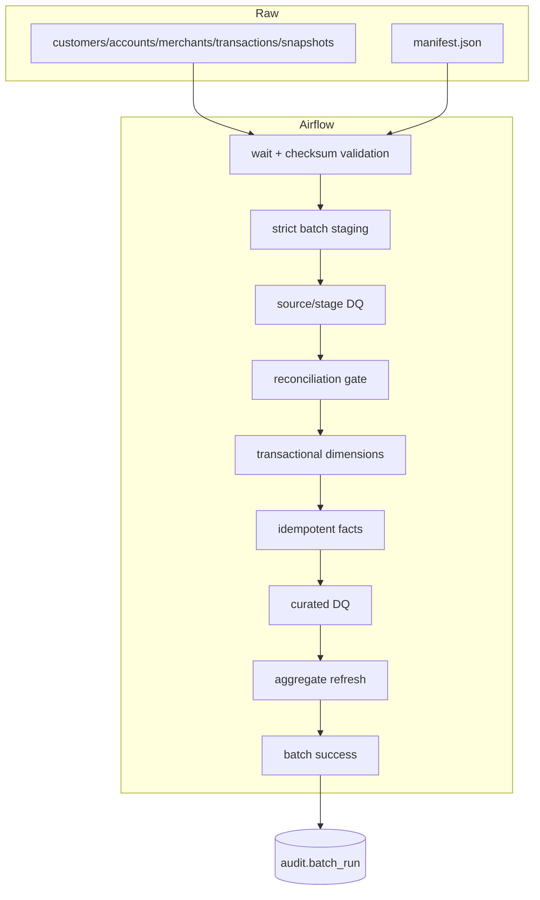

# Architecture

The batch boundary is `(business_date, batch_id)`. A producer writes five immutable CSV objects and writes the manifest last. Airflow derives the path only from its timezone-aware data interval; operators cannot redirect a run to an arbitrary object through `dag_run.conf`.

Runtime data flows GCS → staging → curated → analytics. Audit tables receive control evidence throughout. `max_active_runs=1` is retained because cross-batch concurrent SCD publication has not been proven. Composer is optional because it is the primary standing-cost resource.

Consumers are assumed to be risk/operations analysts, finance reconciliation, and downstream BI. The daily aggregate is batch-refreshed: BigQuery materialized-view restrictions make effective-dated multi-table joins a poor fit.
