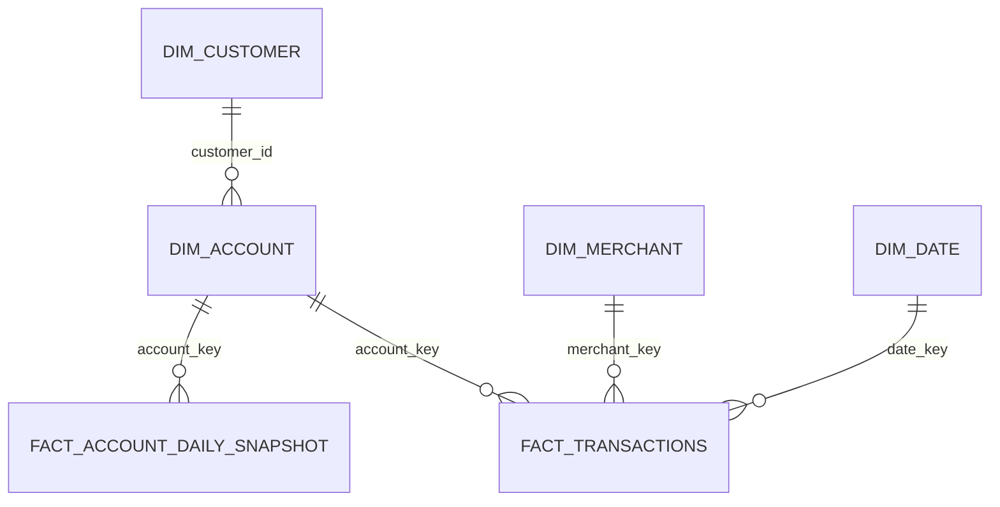

# Data model

| Object | Grain | History / key behavior |
|---|---|---|
| `dim_customer` | customer version | SCD2; durable hashed surrogate |
| `dim_account` | account version | SCD2; balance intentionally excluded |
| `dim_merchant` | merchant version | SCD2 for category/status and descriptive changes |
| `dim_date` | calendar date | SQL-generated 2020–2035, including year |
| `fact_transactions` | transaction event/attempt | natural transaction ID is idempotency key |
| `fact_account_daily_snapshot` | account and business date | exact BigQuery `NUMERIC` balance |

Every history row carries natural key, `effective_from`, `effective_to`, `is_current`, `hash_diff`, `batch_id`, `source_file`, and `loaded_at`. Facts resolve the dimension version whose interval contains the event timestamp. Key `0` is an explicit unknown member. A later repair procedure updates account, customer, and merchant keys only when a dimension version already covers the fact date. Normal backfills therefore run chronologically; arbitrary retroactive SCD insertion is outside this reference scope.

BigQuery PK/FK declarations are `NOT ENFORCED`; pipeline DQ—not BigQuery—provides uniqueness and referential guarantees. Facts require partition filters and cluster on representative join keys (`account_key`, `merchant_key`).
